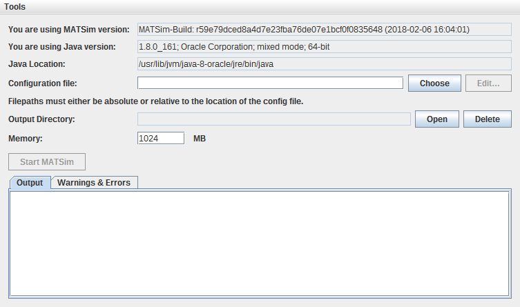
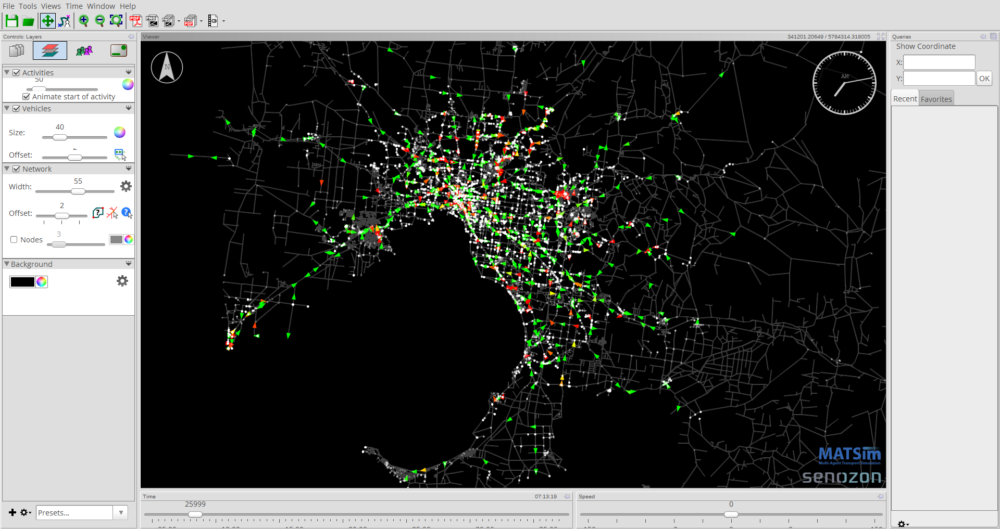

# MATSim-Melbourne

---
## IMPORTANT NOTICE

**17-Jan-2020**

As of today and commit `856f6c4`, the Git history of this project has been rewritten, so if you have cloned this repository prior to this then you will no longer be able to pull changes.

If this applies to you, then please do one of the following:
1. If your's was a "read-only" clone i.e., you have made no commits of your own that need to be merged back, then you can simply discard your old clone and create a fresh clone of the repository. Things should be back to normal for you after that and going forward you will be able to pull changes as before.
1. If your clone has commits that need to be merged back, then create a pull request and let us know. Given that there have been no commits to the repository since Jul 2018, we are assuming that no one is in this boat.

Why did we rewrite Git history?
1. We had been paying for Git-LFS support for 2+ years and had to discontinue that (all good things must end some time). As such, large files are no longer under version control and are archived elsewhere on Cloudstor. The only two subdirectories impacted by this are [`./data`](./data) and [`./results`](./results). See the relevant `README` files in those subdirectories for details of how to access their contents.
1. Once large files were removed, we had the opportunity to shrink the Git repository down in size by removing all traces of the large files from the history. We did this, and the Git repository is a lot leaner now, down from 2GB to ~200MB.

---
## About this project

This repository will provide an open and validated MATSim traffic model for the greater Melbourne area. The project is a collaborative effort between individuals and groups from [RMIT University](http://www.rmit.edu.au), [University of Melbourne](http://www.unimelb.edu.au/), [CSIRO Data61](http://data61.csiro.au/), [Swinburne University](http://www.swinburne.edu.au/), [KPMG Australia](https://home.kpmg.com/au/en/home.html), and others.

---

## Getting started

1. Ensure that you have installed all the pre-requisites as per the section below.

2. Get the project files using git using
```
git clone https://github.com/agentsoz/matsim-melbourne
```

3. In the `matsim-melbourne`, click on the executable `matsim-melbourne-0.0.1-SNAPSHOT-jar-with-dependencies.jar`. This will launch the GUI as shown below:
.

4. Change the **Memory:** field to `4000 MB` or more, and select the **Configuration file:** in `scenarios/2017-11-scenario-by-kai-from-vista/config.xml`. Evidently, you could modify the material of a scenario, in particular the config file.  For example, you may want to set `lastIteration` first to 0 and then to 1 until everything is running smoothly.

5. Click **Start MATSim**. This will run the simulation (might take a few minutes) and put the results in  `scenarios/2017-11-scenario-by-kai-from-vista/output`.

6. Now you can visualise the results in Senozon Via. Please refer to the Via user manual, available from https://via.senozon.com, for how to do this. A snapshot of the Via visualisation for the Vista simulation you just ran is below:

.

---

## Pre-requisites

### 1. Java

You will need Java installed on your machine to be able to run the MATSim Melbourne GUI. If unsure, go to  https://www.java.com/en/ to find out if you already have Java installed, and/or to get the correct version of Java for your operating system.

If you are not going to be doing any development, but just want to use the tool, you only need the Java Runtime Environemnt (JRE) installed. *For development, we use [Open JDK 11](https://openjdk.java.net/projects/jdk/11/).*

<!--
### 2. Support for large files (Git-LFS)

If you are just using the project from the browser, you can ignore this section.
If you want to pull a git clone, this is important: Given that the model will invariably be using large data files from various sources, we will use [Git LFS support](https://help.github.com/articles/versioning-large-files/) in GitHub for storing these. The idea is to keep all such files in the `./data` directory. LFS is already set up to track any file in this directory, so there is nothing special you have to do, other than ensuring that you [install Git LFS](https://help.github.com/articles/installing-git-large-file-storage/). Otherwise when you clone the repository you only receive the *pointers* to the large files and not the actual data.
-->

### 3. Git

The recommended way to make a copy of the project on your machine is to *clone* it using [Git](https://git-scm.com/). This will ensure that all large files are correctly imported.

### 4. Visualisation tools


#### Senozon Via visualiser

To be able to visualise the results, download [Senozon Via](https://via.senozon.com/) together with a Free License. Note that the free version will limit the visualisation to 500 vehicles though.

#### Google Earth
An alternative is to use [Google Earth](https://www.google.com/earth/). It can be a bit crude to use, but will also let you visualise the entire population. Ask us if you want to set this up instead (hopefully we will put instructions for that here soon though).

---


## Directory organization

**data** contains original data.  This is sometimes in MATSim format, because that was the
way we received it, but more often it comes in other formats.

**scenarios** contains generated MATSim scenarios.  In consequence, these are
files on which a MATSim run can be started.  There are often also intermediate files,
such as plans after routing, since that accelerates MATSim runs a lot.

**results** contains output from MATSim runs.  One should be a bit careful of
putting this into git despite the large file support, but for small (1%) runs it seems
feasible and is useful for many results.  Maybe something like
[http://www.mytardis.org] should be considered for larger outputs.

**src** contains source code

**test** contains test input files (for regression tests)

---

## For Developers

You will need the Java 8 JDK, and Maven to get started. You are a developer so probably know how to do that :)

### How to build and run

To build the project, do:
```concept
mvn clean install
```

#### (Re)create MATSim plans based on VISTA

Find the `CreateDemandFromVISTA` class somewhere under `src/main` and look there.

#### (Re)create MATSim plans based on LATCH

To convert the Synthetic population generated using the latch algorithm to the MatSim syntax, use the command below. It
generates the output file saved as `population-from-latch.xml.gz` (use --file-format x to save in the xml format)

To parse the entire synthetic population
```concept
mvn exec:java -Dexec.mainClass="io.github.agentsoz.matsimmelbourne.demand.latch.CreatePopulationFromLatch" --output-dir . --run-mode
f --file-format z
```
To parse 100 people only from the synthetic population
```concept
mvn exec:java -Dexec.mainClass="io.github.agentsoz.matsimmelbourne.demand.latch.CreatePopulationFromLatch" --output-dir . --run-mode
d --sample-population 100 --file-format z
```

To convert the Synthetic households generated using the latch algorithm to the MatSim syntax, use the command below. It
generates the output file saved as `households-from-latch.xml`
```concept
mvn exec:java -Dexec.mainClass="io.github.agentsoz.matsimmelbourne.demand.latch.CreateHouseHoldFromLatch"
```

To generate the MatSim activity plans for the Synthetic population, use the command below.
It generates the output file for certain residence locations (progressive build-up by uploading MTWP files
generated from ABS Table builder and stored under data/census/2011/mtwp/2018-02-16-mtwp-files/)saved as
`population-with-home-work-trips.xml.gz`
```concept
mvn exec:java -Dexec.mainClass="io.github.agentsoz.matsimmelbourne.demand.latch.AssignTripsToPopulationv1"
```

"NOTE - The file 'AssignTripsToPopulation.java' was developed in an effort to calculate residence workforce proportions
to decide the proportionate number of trips to destination locations. Significant number of trips are not assigned in
using proportions and tying residence and workforce proportions"

UNUSED - To generate the MatSim activity plans using probabilistic calculation for transport mode and destination
location (considers people between the age of 15 and 84 to be working and, does not factor in person characteristics in
assigning trips), use the command below. It generates the output file saved as `population-with-home-work-trips.xml.gz`
```concept
mvn exec:java -Dexec.mainClass="io.github.agentsoz.matsimmelbourne.demand.latch.AddWorkPlacesToPopulation"
```

#### Run MATSim

Then to run the built simulation with the generated MATSim population, run `MATSimGUI` in the matsim-melbourne project.  This can
* either be done from the IDE
* or be done from the command line as follows:
```concept
mvn exec:java -Dexec.mainClass="org.matsim.gui.MATSimGUI"
```
Then choose the correct config file (presumably in the `scenarios' directory), then run.

If you are a bit more experienced, you could copy `RunMelbourneTemplate.java`, adjust to your needs, and run that one.


---

## Contributors

* Karthikey Surineni, RMIT University
* Claire Boulange, RMIT University
* Dhirendra Singh, RMIT University
* Jonathan Arundel, RMIT University
* Kai Nagel, TU Berlin
* Leorey Marquez, Data61/CSIRO
* Lin Padgham, RMIT University
* Nicole Ronald, Swinburne University
* Renan Grace, KPMG
* Roberto Sabatini, RMIT University
* Sara Moridpour, RMIT University
* Stephan Winter, University of Melbourne
* Zahra Navidi, University of Melbourne

## License

Open source license still to be agreed.
