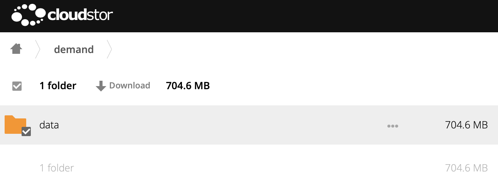
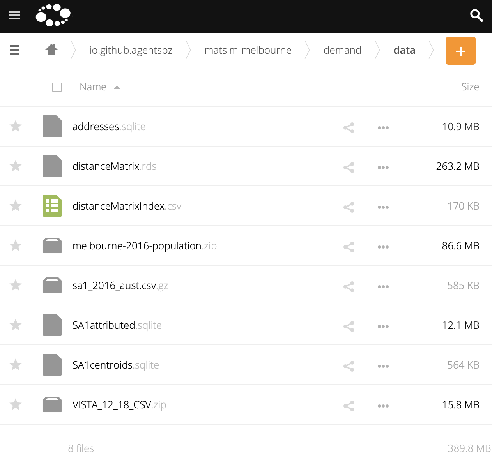

# Population Synthesis Data

This directory contains all the data files required for generating the MATSim demand, i.e., population with activities and trips, for Melbourne based on [ABS 2016](https://www.abs.gov.au/websitedbs/censushome.nsf/home/2016) and [VISTA 2012-2018](https://transport.vic.gov.au/about/data-and-research/vista).

Due to its size this data is stored outside this Git repository.

1. To download the data go to [this Cloudstor location](https://cloudstor.aarnet.edu.au/plus/s/xFhjoeRqwx21aGr?path=%2Fdemand), select the `data` folder, and download it as shown in the image below.
  

1. Once downloaded, extract the archive into this directory so that you have the following new files in this directory.
  

1. Unzip the `<file>.zip` files into subdirectories named `<files.zip>.dir`. (There is a convenience script `./prepare.sh` that will do that, if Bash is an option for you.)

When you are all done, the current directory should contain the following new files and sub-directories.
```
addresses.sqlite
distanceMatrix.rds
distanceMatrixIndex.csv
melbourne-2016-population.zip
melbourne-2016-population.zip.dir/
sa1_2016_aust.csv.gz
SA1attributed.sqlite
SA1centroids.sqlite
VISTA_12_18_CSV.zip
VISTA_12_18_CSV.zip.dir/
```
