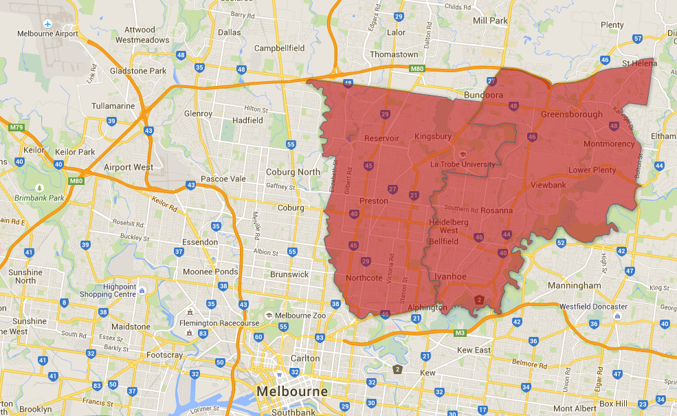

# LATCH (Synthetic Population) Analysis
___
This document provides details about the synthetic population created in resident household 
SA2 regions within the Darebin-Banyule extent, the methodology behind assigning journey-work trips to random 
locations within all Victorian SA2 regions and corresponding generated output files to be used by MATSim to model the traffic flow.

## Input Files
___

To create the synthetic population in a format that can be used by MATSim, a few files containing information about 
the population will need to be used. They can be found under the directory 
`data\census\2011\latch\2018-02-01-files-from-bhagya`. The following lists the files and their details:

* **AllAgents.csv** -  Contains information about the 'Agents' or 'Population'. Details include AgentID (Key index), 
Age, Gender, GroupId (HouseholdId), PartnerId (Married partner's Id), MotherId, FatherId, ChildrenId, RelativeId, 
RelationshipStatus 
(Group_HouseHold, Lone_Parent, Lone_Person, Married, O15_Child, Student, U15_Child)

* **AllFamilies.csv** - Contains information about the families in each household. FamilyId, Family_Type 
(Lone_Person, One_Parent, Couple_Only, Couple_with_Children, Group_Household), Family Size (Number of members), 
Members (AgentId's of the members in the family), HouseholdId.

* **AllHouseholds.csv** - Contains information about the households. GroupId (Household Id), GroupType, GroupSize 
(Household size), Members (Agent Id's of family members), Bedrooms , DwellingStructure, FamilyIncome, Tenure&Landlord, 
Address 

* **Hh-mapped-address.json** - Contains information about the household property. This includes property features, 
geometry and location features.

* **BuildingcumSA1andDwellingProperties.json** - ????

***NOTE: The files under `data\census\2011\latch\2017-11-30-files-from-bhagya` represent an older version of the 
input files with slight differences in the formats. Code changes will need to be implemented to work with files in this 
directory*** 

## Parsing the Population
___
The population covers residents in the **Darebin-Banyule** region. This can be seen in the figure 

The `CreatePopulationFromLatch.java` file is run to generate the output file `population-from-latch.xml.gz`. The input 
files used by the program are `AllAgents.csv, Hh-mapped-address.json` files. The following steps outline the 
process of parsing the population to the output format:

**i)** The households from the file `Hh-mapped-address.json` file are parsed from the json format and stored 
locally. The main information used from this file are the household id's and the sa1 7 digit code used to represent 
the location for the household.

**ii)** The population is read from the file `AllAgents.csv` file. The agent or person's characteristics and 
information about the household (household id) to which they belong are extracted.

**iii)** The extracted person information, household id and sa1 7 digit code location information are stored as 
attributes in the output file. This information is stored for all the persons in the input agents file.

****Population Sampling****
___
The population consists of around 232,050 agents. To limit the analysis to a subset of the population include the 
program arguments `--run-mode d --sample-population [number of agents]`

****Output File Format Variation****
___
The output file format is compressed and stored in the `.gz` format. To store without compression in the `.xml` 
format use the following arguments `--file-format x`

****Output directory****
___
The default output directory is the parent working directory. To change use the command `--output-dir [path]`

## Assigning journey-to-work trips
