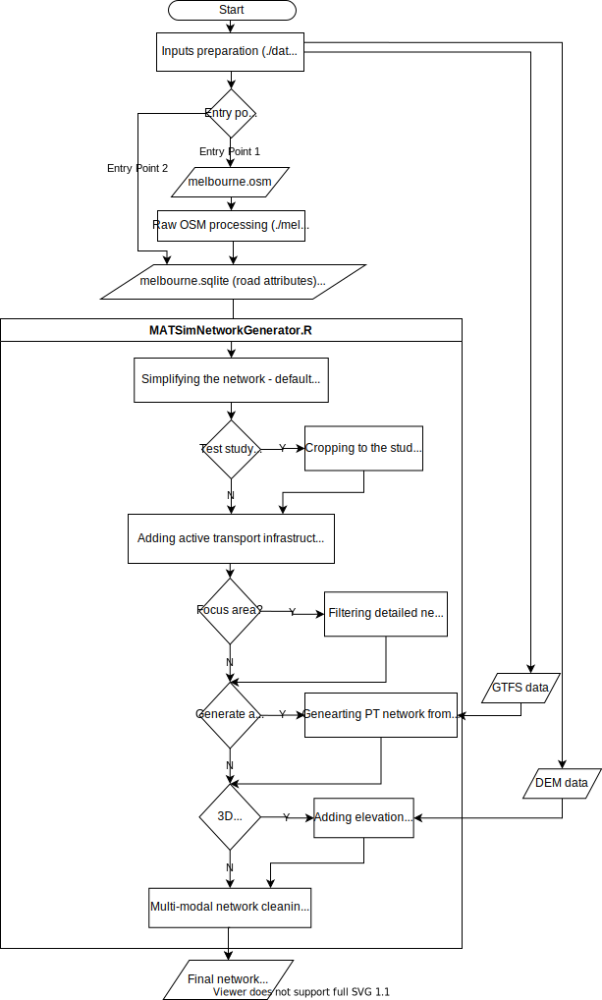

# MATSim network for Melbourne

This page explains the steps for building a MATSim network for Melbourne, including active transportation related infrastructure and attributes. To do so, you can start from a raw OSM extract (entry point 1) or from a set of nodes, edges and edge attributes in a format similar to OSM (entry point 2).    

## Setup

### Prerequisites
* R
* Required R packages
* Postgres [if starting from raw OSM]
* GDAL/OGR [if starting from raw OSM]

### Data

To get started, you must first download the required input files for generating the network. The required input files depend on the selected entry point and what functions are going to be used during network generation. See `./data/README.md` for more details about the input files. A script is also provided that can be used to download relevant input files. For example, if the starting point is from raw OSM (entry point 1) and GTFS2PT is also going to be used to generate PT network, the following script will download the required inputs:
```
cd data && ./prepare.sh -osm19 -gtfs19
```

## Overview of the process
This diagram provides an overview of the network generation process.


## Building the network
### Starting from raw OSM (Entry point 1)

**Minimum** required inputs to start from here is `melbourne.osm`.
```
cd data && ./prepare.sh -osm19
```
After downloading all the required input files, run `./melbNetwork.sh` to process raw OSM data:
```
./melbNetwork.sh
```
If running successfully, it generate these two outputs: `network.sqlite` and  `melbourne.sqlite`.
Then run `./MATSimNetworkGenerator.R` to generate the MATSim network:
```
Rscript ./MATSimNetworkGenerator.R
```
There a number of options that you can configure from within `MATSimNetworkGenerator.R` to produce your desired network, including:
- Cropping the network to a specific study area,
- Limiting the detailed network only for a focus area, major network for the rest
- Simplifying the network: minimum link threshold (default=20m)
- Including the road elevation
- Generating PT network from GTFS
- MATSim network outputs format (xml and sqlite)

Make sure they are properly adjusted before running the script.

### Starting from nodes, edges and edge attributes (Entry point 2)
In this case, you will skip running `./melbNetwork.sh` and download the previously generated files instead.
**Minimum** required inputs to start from here are `melbourne.sqlite` and `network.sqlite `. To download these use the following:
```
cd data && ./prepare.sh -melb -net
```
After downloading all the required input files, you can skip running the `./melbNetwork.sh` and start directly from `./MATSimNetworkGenerator.R`:
```
Rscript ./MATSimNetworkGenerator.R
```
